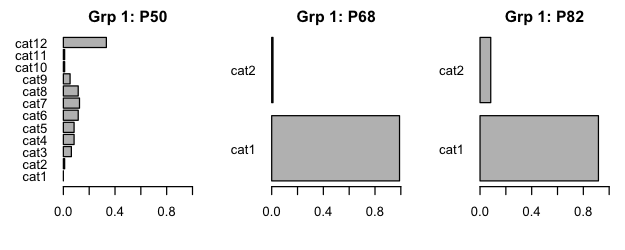
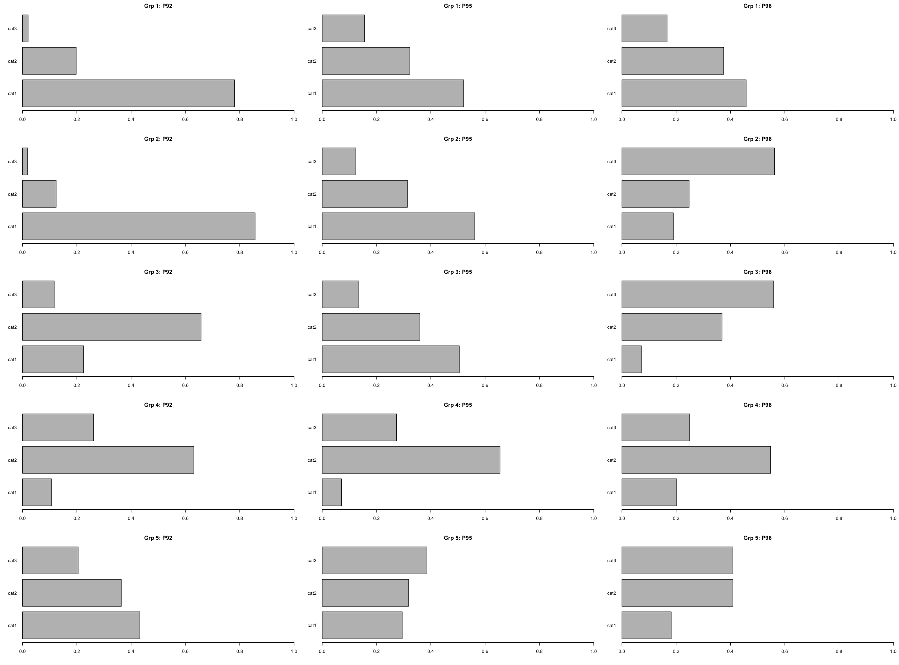
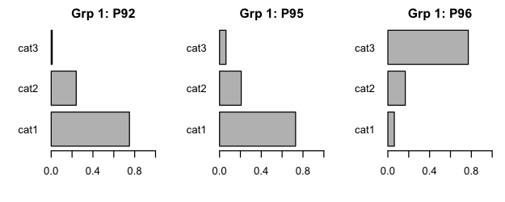
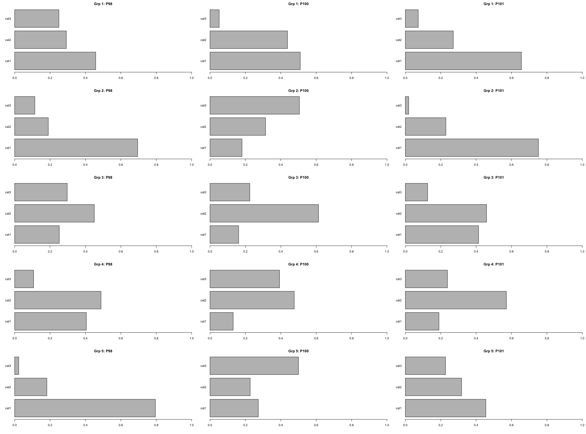

# Clustering with whole datasets
**Author: Chuwen Zhong, Zhanchao Yang**

## Variable use

### Demographic Variable
- Line: 1 or 2
- P10 (gender): male or female
- P12 (Education): low-high (cat 12: NA)
- P14 (occupation)
- P1 (housing type)
- P50 (income): low to high (cat 12: NA)
- P82 (rent or own)
- Edad (age): low to high

### Perception Variable
- P68: Whether to support (binary)

**Three-choice Variable: Agree, Neither agree nor disagree, Disagree**
- P87: housing values
- P90: safety
- P91: expense
- P92: business
- P95: Public transit
- P96: time
- P98: noise
- P100: Public space
- P101: Housing project

## Latent Classic Analytics (LCA) Clustering

Latent Class Analysis is a model‐based clustering method for finding unobserved (“latent”) subgroups in multivariate categorical data. Unlike distance‐based clustering (e.g., k-means), LCA assumes that an underlying categorical variable (the latent class) drives the joint distribution of observed indicators.

**Model Formulation**

Given $J$ categorical variables $Y_1,\dots,Y_J$ and $C$ latent classes:

$$
P(Y_1=y_1,\dots,Y_J=y_J)
=\sum_{c=1}^C P(C=c)\prod_{j=1}^J P(Y_j=y_j \mid C=c)
$$

- **Class prevalences** $\pi_c = P(C=c)$, $\sum_c \pi_c = 1$.
- **Item probabilities** $\theta_{jc}(k) = P(Y_j = k \mid C=c)$.

**Estimation via EM**

1. **E‐step**: Compute posterior class membership probabilities for each case.

   $$
   \gamma_{i,c}
   = P(C=c \mid \mathbf{Y}_i)
   = \frac{\pi_c \prod_j \theta_{j,c}(y_{i,j})}
          {\sum_{c'} \pi_{c'} \prod_j \theta_{j,c'}(y_{i,j})}
   $$

2. **M‐step**: update parameters using these posteriors:

   $$
   \pi_c \leftarrow \frac{1}{N} \sum_{i=1}^N \gamma_{i,c},
   \quad
   \theta_{j,c}(k) \leftarrow
   \frac{\sum_{i: y_{i,j}=k} \gamma_{i,c}}{\sum_i \gamma_{i,c}}
   $$

Iterate until convergence of the log‐likelihood.

**Results table (k = 5)**
| Variable | Cluster 1                         | Cluster 2                         | Cluster 3                         | Cluster 4                         | Cluster 5                         |
|----------|-----------------------------------|-----------------------------------|-----------------------------------|-----------------------------------|-----------------------------------|
| line     | 58.9, 41.1                        | 54.5, 45.5                        | 39.1, 60.9                        | 35.5, 64.5                        | 73.2, 26.8                        |
| Gender      | 68, 32                            | 59.1, 40.9                        | 72.5, 27.5                        | 48.4, 51.6                        | 54.9, 45.1                        |
| Education     | 0, 1.5, 2.5, 18.8, 3, 13.7, 7.6, 17.8, 1.5, 26.9, 6.6, 0  | 6.8, 21.6, 22.7, 10.2, 1.1, 8, 2.3, 11.4, 3.4, 6.8, 2.3, 3.4  | 8.7, 8, 10.1, 21.7, 1.4, 26.8, 3.6, 4.3, 5.8, 8.7, 0, 0.7    | 9.7, 35.5, 0, 16.1, 0, 6.5, 6.5, 19.4, 6.5, 0, 0, 0           | 1.2, 12.2, 2.4, 30.5, 2.4, 24.4, 4.9, 2.4, 2.4, 9.8, 3.7, 3.7  |
| Occupation      | 3, 0.5, 0, 5.1, 0.5, 36.5, 4.6, 11.2, 4.6, 30.5, 0, 0, 3.6  | 0, 0, 1.1, 0, 0, 1.1, 0, 3.4, 4.5, 18.2, 0, 1.1, 70.5           | 3.6, 0.7, 0, 3.6, 0, 31.9, 0, 1.4, 18.8, 25.4, 2.9, 4.3, 7.2 | 0, 0, 12.9, 0, 0, 0, 0, 0, 16.1, 25.8, 0, 3.2, 41.9          | 1.2, 0, 4.9, 0, 1.2, 26.8, 2.4, 4.9, 8.5, 35.4, 0, 0, 14.6   |
| Housing type       | 60.9, 36, 0, 3, 0                  | 79.5, 17, 1.1, 0, 2.3             | 54.3, 37, 8.7, 0, 0               | 80.6, 9.7, 9.7, 0, 0               | 56.1, 40.2, 3.7, 0, 0             |
| Income      | 0.5, 7.6, 8.1, 11.2, 12.2, 13.2, 13.2, 11.2, 4.1, 2, 0.5, 16.2  | 10.2, 8, 6.8, 17, 12.5, 6.8, 12.5, 6.8, 9.1, 0, 1.1, 9.1   | 0.7, 6.5, 15.9, 27.5, 13.8, 6.5, 2.2, 7.2, 0, 0.7, 0, 18.8  | 3.2, 0, 16.1, 16.1, 9.7, 29, 3.2, 0, 3.2, 0, 0, 19.4              | 1.2, 8.5, 4.9, 6.1, 11, 2.4, 14.6, 1.2, 0, 0, 0, 50              |
| Support or not      | 88.3, 11.7                        | 93.2, 6.8                        | 100, 0                           | 77.4, 22.6                        | 89, 11                           |
| Rent or own      | 37.6, 62.4                        | 80.7, 19.3                       | 11.6, 88.4                      | 45.2, 54.8                        | 57.3, 42.7                       |
| P87      | 82.2, 15.2, 2.5                   | 83, 17, 0                        | 44.2, 50.7, 5.1                 | 54.8, 32.3, 12.9                  | 52.4, 45.1, 2.4                  |
| P90      | 37.6, 35, 27.4                    | 44.3, 27.3, 28.4                | 24.6, 69.6, 5.8                 | 12.9, 35.5, 51.6                  | 14.6, 70.7, 14.6                 |
| P91      | 84.3, 15.7, 0                     | 68.2, 30.7, 1.1                 | 44.2, 55.8, 0                   | 58.1, 9.7, 32.3                   | 19.5, 75.6, 4.9                  |
| P92      | 73.6, 18.8, 7.6                   | 72.7, 27.3, 0                   | 47.1, 50, 2.9                   | 22.6, 6.5, 71                     | 11, 79.3, 9.8                    |
| P95      | 49.7, 33.5, 16.8                  | 67, 23.9, 9.1                   | 59.4, 23.2, 17.4                | 12.9, 25.8, 61.3                  | 13.4, 80.5, 6.1                  |
| P96      | 24.9, 25.9, 49.2                  | 25, 30.7, 44.3                  | 21, 26.8, 52.2                  | 9.7, 19.4, 71                     | 0, 75.6, 24.4                    |
| P98      | 72.6, 11.7, 15.7                  | 44.3, 25, 30.7                  | 23.9, 39.1, 37                  | 67.7, 16.1, 16.1                  | 15.9, 81.7, 2.4                  |
| P100     | 28.4, 23.9, 47.7                  | 51.1, 43.2, 5.7                 | 26.8, 57.2, 15.9                | 9.7, 29, 61.3                     | 8.5, 79.3, 12.2                  |
| P101     | 69.5, 15.7, 14.7                  | 72.7, 22.7, 4.5                 | 55.1, 39.1, 5.8                 | 48.4, 3.2, 48.4                   | 6.1, 92.7, 1.2                   |
| Age    | 2, 23.4, 32.5, 28.4, 13.7, 0      | 1.1, 0, 0, 10.2, 25, 63.6        | 14.5, 13, 18.1, 20.3, 21, 13     | 0, 12.9, 9.7, 6.5, 25.8, 45.2      | 1.2, 7.3, 26.8, 20.7, 24.4, 19.5 |

### Chart

### Takeaway

The Latent Classic Analytics cluster method hasn't distinguished between people who support or do not support the metro project.

#### Cluster 1: “Value-Driven Homeowners”
- **Profile & Support**
  - Predominantly homeowners (62 % own vs. 38 % rent)
  - Mixed ages, slightly skewed male
  - Strong majority support (88 %) for the Metro project
- **Perceptions**
  - 82 % agree it will boost housing values
  - 84 % agree it will reduce living expenses
  - 74 % agree it will spur local business
  - Only 50 % agree on transit improvements
  - 49 % doubt it will save travel time
- **Implication**
  - Emphasize property-value gains and cost-saving benefits in homeowner outreach
  - Provide concrete data on travel-time savings to address efficiency concerns

#### Cluster 2: “Senior Renters Enthusiasts”
- **Profile & Support**
  - Older renters (81 % rent; 64 % in the oldest age bracket)
  - Very high support (93 %)
  - Balanced income and education levels
- **Perceptions**
  - 83 % believe in housing value gains
  - 67 % see transit benefits
  - 44 % worry it won’t cut travel time
  - 44 % expect safety improvements
- **Implication**
  - Highlight mobility and safety features tailored to seniors
  - Showcase real-world examples of reduced door-to-destination times

#### Cluster 3: “Homeowner Fence-Sitters”
- **Profile & Support**
  - Almost entirely homeowners (88 % own)
  - 100 % support, but mostly neutral on benefits
- **Perceptions**
  - 40–70 % “neither agree nor disagree” across benefit items
- **Implication**
  - Provide clear, detailed case studies
  - Use before-and-after metrics from comparable neighborhoods

#### Cluster 4: “Skeptical Elders”
- **Profile & Support**
  - Older cohort (45 % in the oldest age bracket)
  - Balanced rent/own
  - Lowest support (77 %)
- **Perceptions**
  - Less than 50 % disagree that it will be safe or reduce noise
  - 61 % doubt transit benefits
  - 71 % doubt travel-time savings
- **Implication**
  - Organize community forums on safety and noise mitigation
  - Bring in peer testimonials about actual time savings

#### Cluster 5: “Affluent Pragmatists”
- **Profile & Support**
  - Highest-income group (50 % in top bracket)
  - Even split homeowners/renters
  - 89 % in favor, but largely indifferent
- **Perceptions**
  - 75–92 % “neither agree nor disagree” on most items
- **Implication**
  - Deliver concise, data-driven briefs on ROI
    - Societal: congestion reduction, environmental impact
    - Personal: commute times, property appreciation

## K-means

### Context
Since the k-means algorithm is only suitable for dealing with ordinal data (based on scales) or numeric data, categorical data were excluded from this analysis. Excluding variables include occupation and housing type. Binary variable was treated as 1 or 2 scale. Ordinal variables, including age, education level, and income level, were treated as continuous numeric variables. For example, people who only received a middle school degree are two scales level lower than people who received a technical college degree. To better suit the context of the survey table, the final results were yielded back as similar to the previous Latent Classic Analytics table, which indicates the probabilities in each clustering rather than the centroid or means.

### Results
**Results table (k = 6)**

| Variable | Cluster 1                                    | Cluster 2                                    | Cluster 3                                    | Cluster 4                                    | Cluster 5                                    | Cluster 6                                    |
|---|---|---|---|---|---|---|
| line | 36.5, 63.5 | 51.4, 48.6 | 41.4, 58.6 | 72.6, 27.4 | 38.6, 61.4 | 79.2, 20.8 |
| Gender  | 66.7, 33.3 | 63.8, 36.2 | 65.8, 34.2 | 56, 44     | 59.1, 40.9 | 71.9, 28.1 |
| Education | 8.3, 19.8, 21.9, 18.8, 2.1, 18.8, 2.1, 3.1, 3.1, 1, 0, 1 | 0, 0, 3.8, 16.2, 0, 16.2, 4.8, 19, 5.7, 29.5, 3.8, 1 | 9.9, 8.1, 4.5, 26.1, 3.6, 19.8, 4.5, 9.9, 3.6, 7.2, 0.9, 1.8 | 0, 16.7, 3.6, 20.2, 1.2, 26.2, 4.8, 6, 3.6, 13.1, 2.4, 2.4 | 2.3, 6.8, 9.1, 15.9, 4.5, 2.3, 11.4, 13.6, 2.3, 25, 6.8, 0 | 2.1, 9.4, 4.2, 18.8, 2.1, 13.5, 7.3, 14.6, 1, 17.7, 8.3, 1 |
| Income  | 9.4, 15.6, 11.5, 24, 14.6, 7.3, 5.2, 4.2, 2.1, 0, 0, 6.2 | 1, 5.7, 8.6, 15.2, 11.4, 12.4, 12.4, 11.4, 4.8, 1.9, 0, 15.2 | 1.8, 10.8, 16.2, 21.6, 20.7, 6.3, 9, 3.6, 0, 0, 0, 9.9 | 1.2, 0, 4.8, 8.3, 4.8, 10.7, 9.5, 4.8, 3.6, 0, 0, 52.4 | 0, 9.1, 11.4, 15.9, 11.4, 11.4, 11.4, 9.1, 4.5, 4.5, 2.3, 9.1 | 0, 1, 6.2, 8.3, 8.3, 11.5, 12.5, 11.5, 5.2, 1, 1, 33.3 |
| Support or not  | 100, 0     | 100, 0     | 100, 0     | 100, 0     | 0, 100     | 99, 1      |
| Rent or Own  | 37.5, 62.5 | 8.6, 91.4  | 4.5, 95.5  | 84.5, 15.5 | 29.5, 70.5 | 91.7, 8.3  |
| P87  | 84.4, 15.6, 0 | 79, 19, 1.9 | 32.4, 60.4, 7.2 | 59.5, 36.9, 3.6 | 65.9, 22.7, 11.4 | 80.2, 19.8, 0 |
| P90  | 43.8, 38.5, 17.7 | 30.5, 44.8, 24.8 | 18.9, 72.1, 9   | 27.4, 45.2, 27.4 | 36.4, 34.1, 29.5 | 30.2, 42.7, 27.1 |
| P91  | 87.5, 11.5, 1 | 91.4, 8.6, 0 | 23.4, 73.9, 2.7 | 42.9, 50, 7.1 | 59.1, 31.8, 9.1 | 55.2, 43.8, 1 |
| P92  | 78.1, 19.8, 2.1 | 85.7, 12.4, 1.9 | 22.5, 65.8, 11.7 | 10.7, 63.1, 26.2 | 43.2, 36.4, 20.5 | 75, 24, 1  |
| P95  | 52.1, 32.3, 15.6 | 56.2, 31.4, 12.4 | 50.5, 36, 13.5  | 7.1, 65.5, 27.4 | 29.5, 31.8, 38.6 | 72.9, 20.8, 6.2 |
| P96  | 45.8, 37.5, 16.7 | 19, 24.8, 56.2  | 7.2, 36.9, 55.9  | 20.2, 54.8, 25  | 18.2, 40.9, 40.9 | 6.2, 16.7, 77.1 |
| P98  | 45.8, 29.2, 25  | 69.5, 19, 11.4  | 25.2, 45, 29.7   | 40.5, 48.8, 10.7 | 79.5, 18.2, 2.3  | 36.5, 25, 38.5 |
| P100 | 51, 43.8, 5.2 | 18.1, 31.4, 50.5 | 16.2, 61.3, 22.5 | 13.1, 47.6, 39.3 | 27.3, 22.7, 50  | 40.6, 46.9, 12.5 |
| P101 | 65.6, 27.1, 7.3 | 75.2, 22.9, 1.9  | 41.4, 45.9, 12.6 | 19, 57.1, 23.8  | 45.5, 31.8, 22.7 | 76, 19.8, 4.2  |
| Age | 1, 0, 9.4, 21.9, 36.5, 31.2 | 9.5, 34.3, 31.4, 20, 4.8, 0 | 12.6, 17.1, 28.8, 17.1, 14.4, 9.9 | 1.2, 8.3, 13.1, 19, 22.6, 35.7 | 0, 15.9, 22.7, 20.5, 25, 15.9 | 0, 5.2, 19.8, 27.1, 20.8, 27.1 |
| count | 96       | 105      | 111      | 84       | 44       | 96       |

### Chart

### Takeaway
The k-means clustering successfully separates the non-support groups from other clusters.

#### Cluster 1: Homeowner Traditionalists
- **Demographics**: Predominantly male; majority homeowners; mid-to-high education and moderate incomes.
- **Perceptions**:
  - Expense concern: 87.5%
  - Housing-value optimism: 84.4%
  - Business benefits optimism: 78.1%
  - Public-transit support: 52.1%
- **Label**: supportive overall but especially attentive to cost and housing-value improvements.

#### Cluster 2: Prosperous Skeptical Owners
- **Demographics**: Balanced gender; overwhelmingly homeowners; skew toward higher education and income deciles.
- **Perceptions**:
  - Expense concern: 91.4% (highest)
  - Business-benefits optimism: 85.7%
  - Noise worry: 69.5% (very high)
  - Travel-time gains doubt: 56.2% disagree
  - Public-space benefits doubt: 50.5% disagree
- **Label**: affluent supporters of investment but doubtful of time- and space-related gains.

#### Cluster 3: Neutral-Lean Supporters
- **Demographics**: Mostly homeowners; moderate gender balance; education/income clustered around mid-levels.
- **Perceptions**:
  - “Neither agree nor disagree” majority on housing values (60.4%), safety (72.1%), expense (73.9%) and business (65.8%)
  - Moderate transit support: 50.5%
- **Label**: generally in favor but largely indifferent on most project impacts.

#### Cluster 4: Older Renters with Low Transit Expectations
- **Demographics**: Slight female tilt; predominantly renters; older age profile; many with missing income data.
- **Perceptions**:
  - Housing-value support: 59.5%
  - Expense concern: 42.9%
  - Business-benefits optimism: 10.7%
  - Transit-benefits optimism: 7.1%
  - Mixed noise/public-space views
- **Label**:  supportive on housing values but skeptical about business and transit improvements.

#### Cluster 5: Non-Supporters & Noise Worriers
- **Demographics**: Majority homeowners; balanced gender; mid-to-high education and income.
- **Perceptions**:
  - 100% non-support for the project
  - Noise concern: 79.5%
  - Expense worry: 59.1%
  - Public-transit support: 29.5%
  - Public-space support: 27.3%
- **Label**: firmly opposed, driven by noise and cost concerns.

#### Cluster 6: Young Transit Enthusiasts
- **Demographics**: Heavily male; overwhelmingly renters; younger-to-mid age; moderate education/income.
- **Perceptions**:
  - Housing-value support: 80.2%
  - Business-benefits optimism: 75%
  - Transit-benefits optimism: 72.9%
  - Overall project support: 76%
  - Travel-time gains doubt: 77.1% disagree
- **Label**: enthusiastic about broad benefits but skeptical it will save travel time.

## Hierarchical Clustering

### Results

**Summary tables (k=5)**
| Variable | Cluster 1               | Cluster 2               | Cluster 3               | Cluster 4               | Cluster 5               |
|----------|-------------------------|-------------------------|-------------------------|-------------------------|-------------------------|
| line     | 83.2, 16.8              | 16.7, 83.3              | 84, 16                  | 43.9, 56.1              | 27.4, 72.6              |
| P10      | 76.6, 23.4              | 25, 75                  | 56, 44                  | 75, 25                  | 58.3, 41.7              |
| P12      | 2.2, 16.1, 5.1, 17.5, 3.6, 14.6, 8, 6.6, 2.9, 16.8, 5.1, 1.5 | 8.3, 6.7, 10, 13.3, 5, 16.7, 1.7, 15, 0, 18.3, 3.3, 1.7 | 2.7, 9.3, 5.3, 28, 0, 25.3, 8, 5.3, 1.3, 6.7, 2.7, 5.3 | 2.8, 7.8, 10, 20.6, 1.7, 15.6, 4.4, 17.8, 3.3, 13.9, 2.2, 0 | 8.3, 8.3, 7.1, 19, 0, 19, 2.4, 6, 8.3, 17.9, 3.6, 0 |
| P50      | 2.9, 5.8, 8.8, 12.4, 5.8, 10.9, 7.3, 10.9, 6.6, 0, 0.7, 27.7 | 5, 11.7, 13.3, 13.3, 25, 6.7, 6.7, 5, 3.3, 1.7, 1.7, 6.7 | 1.3, 8, 6.7, 8, 13.3, 5.3, 13.3, 1.3, 1.3, 0, 0, 41.3 | 2.8, 7.2, 9.4, 18.9, 10.6, 12.2, 12.2, 7.8, 2.2, 1.7, 0, 15 | 0, 4.8, 13.1, 23.8, 16.7, 8.3, 8.3, 7.1, 1.2, 1.2, 0, 15.5 |
| P68      | 97.1, 2.9              | 95, 5                   | 93.3, 6.7               | 83.9, 16.1              | 95.2, 4.8               |
| P82      | 73.7, 26.3              | 21.7, 78.3              | 58.7, 41.3              | 30.6, 69.4              | 10.7, 89.3              |
| P87      | 78.1, 20.4, 1.5         | 63.3, 31.7, 5           | 58.7, 40, 1.3           | 85, 10, 5               | 16.7, 79.8, 3.6         |
| P90      | 38, 43.1, 19            | 26.7, 35, 38.3          | 25.3, 68, 6.7           | 40.6, 27.2, 32.2        | 3.6, 92.9, 3.6          |
| P91      | 65, 30.7, 4.4           | 91.7, 5, 3.3            | 10.7, 88, 1.3           | 82.8, 14.4, 2.8         | 23.8, 75, 1.2           |
| P92      | 62.8, 29.9, 7.3         | 76.7, 18.3, 5           | 6.7, 89.3, 4            | 65.6, 21.7, 12.8        | 41.7, 46.4, 11.9        |
| P95      | 56.2, 28.5, 15.3        | 28.3, 68.3, 3.3         | 14.7, 78.7, 6.7         | 57.8, 17.2, 25          | 53.6, 27.4, 19          |
| P96      | 19.7, 19, 61.3          | 18.3, 53.3, 28.3        | 6.7, 80, 13.3           | 27.8, 25, 47.2          | 11.9, 23.8, 64.3        |
| P98      | 37.2, 33.6, 29.2        | 43.3, 46.7, 10          | 24, 69.3, 6.7           | 66.7, 8.3, 25           | 40.5, 35.7, 23.8        |
| P100     | 26.3, 56.2, 17.5        | 20, 50, 30              | 16, 72, 12              | 38.9, 16.7, 44.4        | 21.4, 56, 22.6          |
| P101     | 62.8, 24.8, 12.4        | 50, 36.7, 13.3          | 10.7, 89.3, 0           | 73.3, 14.4, 12.2        | 48.8, 39.3, 11.9        |
| Edad     | 0.7, 8, 21.9, 24.1, 14.6, 30.7 | 0, 21.7, 15, 21.7, 26.7, 15 | 6.7, 8, 26.7, 21.3, 17.3, 20 | 5.6, 15, 20.6, 17.8, 26.7, 14.4 | 11.9, 20.2, 21.4, 21.4, 10.7, 14.3 |
| count    | 137                     | 60                      | 75                      | 180                     | 84                      |
